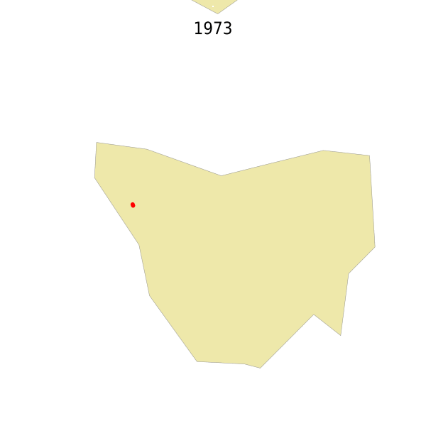

# Create an animated gif of cartographic data via command line, using Mapserver

A person I respect very much, has written to me an email in which he asks to me how to create an animated gif of cartographic data, using the simple and convenient ways typical of the command line.

Several ways to do it, here is the [**Mapserver**](https://mapserver.org/) solution.

## The goal

> What I did was build an animation GIF with my collecting sites in Tasmania. The data are from here: https://doi.org/10.3897/BDJ.9.e70463 but I extracted the Tasmanian collecting events and reduced them to a 3-column table - year, lat, lon - with unique entries (sort | uniq).

The data are points, and in the desired output the red points are those of the specified year and the blue ones, those of the previous years.


## The Mapserver way

> MapServer is an [Open Source](https://opensource.org/) platform for publishing spatial data and interactive mapping applications to the web. Originally developed in the mid-1990’s at the University of Minnesota, MapServer is released under an [MIT-style license](https://mapserver.org//copyright.html#license), and runs on all major platforms ([Windows](https://mapserver.org//download.html#windows), [Linux](https://mapserver.org//download.html#linux), [Mac OS X](https://mapserver.org//download.html#osx)).

It has a cli - [`mapserv`](https://mapserver.org/cgi/mapserv.html#mapserv) - that you can use to create ouputs.
Moreover it can use [run-time substitution](https://mapserver.org/cgi/runsub.html) to change variables values at run-time.

Then I can use it to create a `PNG` output file for every year, and then to process these and create an animated `GIF`.

To use MapServer it's necessary to create a `map file`, a configuration file in which set the geographical bounding box, the input layers you want to use, the graphic styles to apply, etc..<br>
I will not explain here what the syntax is, it is not the purpose of this repository, I'll just make a few comments.

Some points for the [example map file](https://github.com/aborruso/animated-gif-mapserver/blob/main/processing/data.map) I have created:

- I have set a decimal degrees [bounding box](https://github.com/aborruso/animated-gif-mapserver/blob/main/processing/data.map#L7) ([EPSG:4326)](https://epsg.io/4326);
- the coordinate reference system (CRS) of the output is again "latitude, longitude", but it is possible to set the CRS you want;
- I have used 3 layers:
  - one to have a background map, the polygons of [Natural Earh `Admin 0 – Countries` layer](https://www.naturalearthdata.com/downloads/110m-cultural-vectors/), low resolution, used to create an example;
  - the [data layer](https://github.com/aborruso/animated-gif-mapserver/blob/main/processing/data.txt), a 3 fields `CSV` (`decimalLatitude`, `decimalLongitude` and `year`);
  - the layer used to add the year as a label;
- I have set 2 styles for data layer, the red dots for the specified year and the blue dots the previous years. The definition is by variable, passed at run-time via cli (`EXPRESSION ("[year]" < '%year%')`).

The data layer, is defined as [GDAL/OGR virtual layer](https://gdal.org/drivers/vector/vrt.html), that is one of MapServer input formats. It's based on a [XML definition file](https://github.com/aborruso/animated-gif-mapserver/blob/main/processing/data.vrt), to map CSV coordinates fields (and some other metadata).

Then to create a PNG, just run something like:

```bash
mapserv -nh "QUERY_STRING=map=data.map&mode=map&year=1977" >1977.png
```

`data.map` is the Mapserver configuratione file and `year` is a variable that you can change at run-time. Then in bash it could be:

```bash
for i in {1975..2000}; do
  mapserv -nh "QUERY_STRING=map=data.map&mode=map&year=${i}" >${i}.png
done
```

To add for each year, the year as label, I have added this in the query (`labelyear` is the name that I use to add labels to the PNG output):

```
&map_layer[labelyear]=FEATURE+POINTS+300+-560+END+TEXT+"1977"+END
```

It's possible to do it, because in MapServer you can [change map file parameters via URL](https://mapserver.org/cgi/controls.html#changing-map-file-parameters-via-a-form-or-a-url).

## The bash script

I have created a [bash script](https://github.com/aborruso/animated-gif-mapserver/blob/main/myDearRobert.sh) to run all:

- first of all it downloads the data layer and extract `decimalLatitude`, `decimalLongitude` and `year`;
- then it creates a PNG for every year, using MapServer cli;
- then it creates the below animated GIF using [`convert` ImageMagick](https://imagemagick.org/script/convert.php) utility.



## The CSV virtual file

```xml
<OGRVRTDataSource>
     <OGRVRTLayer name="data">
          <SrcDataSource relativeToVRT="1">CSV:data.txt</SrcDataSource>
          <GeometryType>wkbPoint</GeometryType>
          <LayerSRS>WGS84</LayerSRS>
          <GeometryField encoding="PointFromColumns" x="decimalLongitude" y="decimalLatitude"/>
          <Field name="year" src="year" type="integer"/>
     </OGRVRTLayer>
</OGRVRTDataSource>
```
